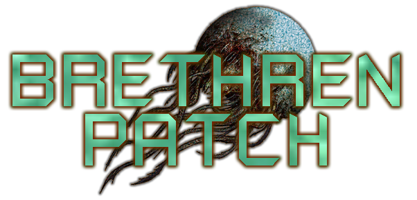

  

# Brethren Patch

Fixes for the PC port of Dead Space 3, in the spirit of the
[Marker Patch](https://github.com/Wemino/MarkerPatch) for Dead Space 2 and
[DeadSpace2008Fixes](https://github.com/seamusduncmcgrath/DeadSpace2008Fixes)
for the first game. Neither of those covers Dead Space 3, and most of their
patches do not transfer, so the addresses here were found from scratch.

Tested against the Steam build.

### Fixes

## VSync no longer locks the game to 30 FPS

With VSync enabled the game runs at exactly 30 FPS whatever the display does.
It is not a D3D9 presentation interval - the swap chain always reports
`IMMEDIATE`, and no device reset happens when VSync is toggled. The entire main
loop runs at 30 Hz.

The cause is the engine's frame rate lock multiplier: the game passes 2 when
VSync is on, and against a 60 Hz vblank that is the 30 FPS you get. The patch
hooks `SetFrameRateLockMultiplier` and clamps the multiplier to 1. Set
`VSyncMultiplier=2` to restore the original behaviour, or `0` for uncapped.

## Physics no longer breaks above 30 FPS

Havok's constraint solving is tuned for a 30 FPS timestep. Above it, contact and
ragdoll constraints get oversolved and corpses or severed limbs launch across
the room. Solver inputs are scaled back to the 30 FPS equivalent for the
duration of each call.

## Subtitles scale with the resolution

Subtitles keep a fixed pixel size, so they shrink as resolution goes up. The
game's drawing object can normalise either against a virtual 1280x720 canvas or
against the real resolution, text takes the second path.

The reference width follows the actual aspect ratio, so ultrawide displays do
not stretch the text horizontally: height stays anchored at 720 and width is
derived, giving 1720x720 at 3440x1440 and exactly 1280x720 on any 16:9 mode.
`UiScalePercent` tunes the size.

## High core count guard (off by default)

Mirrors what the Dead Space (2008) fixes do, but disabled, because the array
overflow the patch works around does not exist in DS3. Enable it only if a many-core machine
actually crashes.

## How to Install

Compatible with all versions of Dead Space 3 (Steam, EA App).

**Download**: [BrethrenPatch.zip](https://github.com/RichardHafer/BrethrenPatch/releases/latest/download/BrethrenPatch.zip)  
Extract the contents of the zip file into the game's folder, in the same directory as the `deadspace3.exe` file.

Or build it yourself as described below.

**Warning**: If the game doesn't start on Windows after installing the patch, try updating to the latest Microsoft Visual C++ Redistributable (x86).  
You can download it here: https://aka.ms/vs/17/release/vc_redist.x86.exe

`BrethrenPatch.log` is written next to the executable and lists every signature
that matched, so a failed scan is visible rather than silent.

## Compatibility with the DS3 Debug Menu

They cannot run together, I already contacted 4kodda about this. The Debug Menu verifies the FNV1a64 hash of the game's
`.text` section to make sure its own hardcoded addresses are trustworthy, and the
hooks here change that section, so it locks its bindings and drops into a safe
overlay. Set `HavokPhysicsFix=0`, `VSyncRefreshRateFix=0` and `UiScaling=0` to
leave the code section untouched when you need the Debug Menu.

## Configuration

All features can be customized in the `BrethrenPatch.ini` file. Every feature is explained there and can be adjusted.
## Building

## Building

Visual Studio 2022 with the x86 toolchain, then `build.bat`. Adjust the
`vcvars32.bat` path in the script if your install differs. safetyhook needs
`std::expected`, hence `/std:c++latest`.

## What still needs to be fixed or looked-into at higher resolutinos
- Soft shadow blur fix
- Depth Of Field
- Bloom
- SDL Controller Support
- Gyro Aiming
- Input Device Filtering
- Entity Persistence
- Skip Intro if possible
- Auto Resolution

## Notes

Addresses are absolute VAs for the build listed above. If a future patch moves
them, the byte patterns in `src/` should still find them; the log will say which
one did not match.

## Credits
- [safetyhook](https://github.com/cursey/safetyhook) for hooking.  
- [mINI](https://github.com/metayeti/mINI) for INI file handling.  

## Licence

MIT, see `LICENSE`. Not affiliated with EA or Visceral Games.
